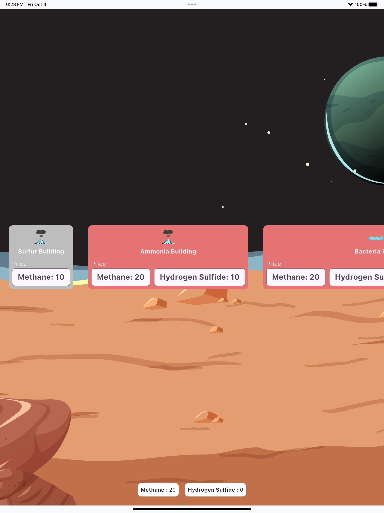
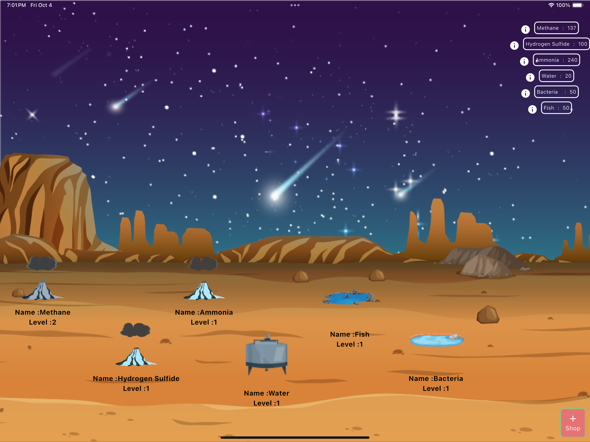
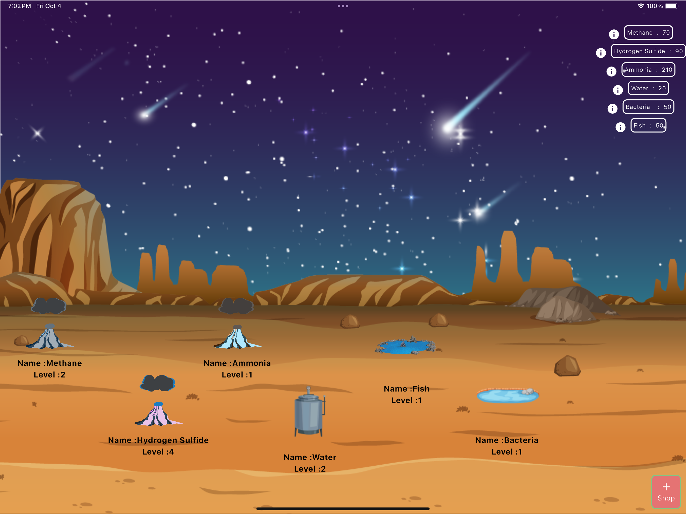
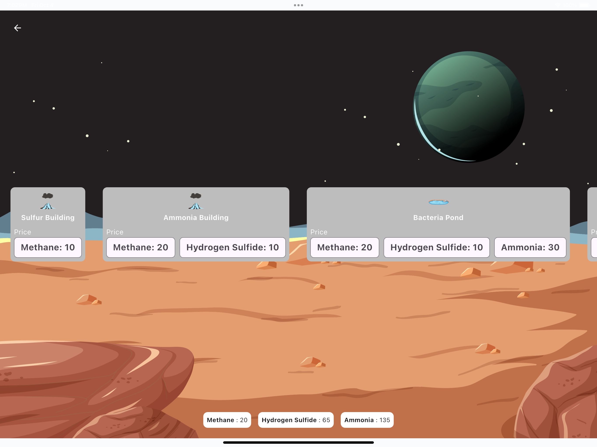
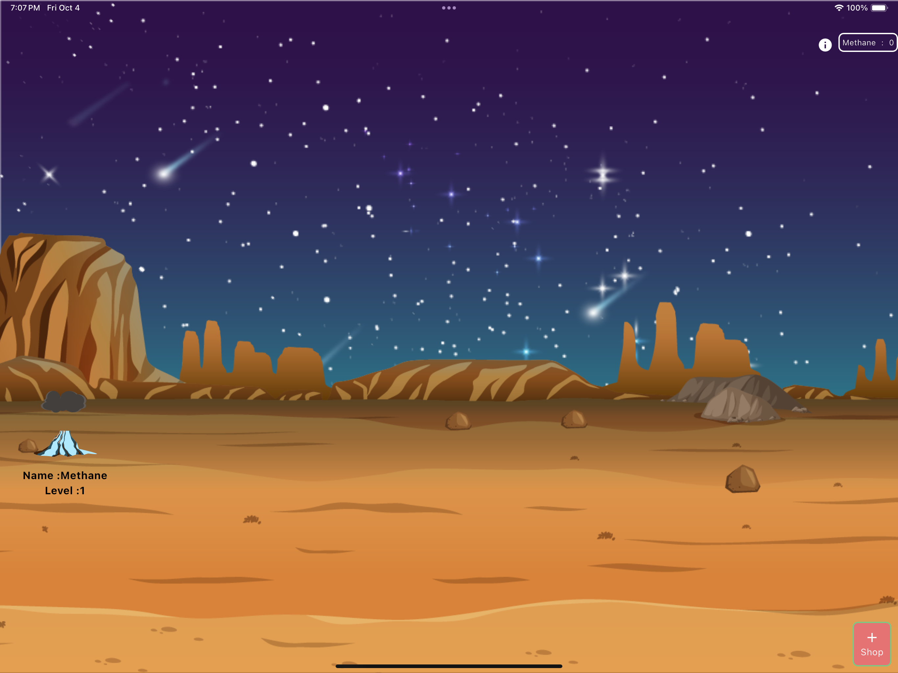

# Journey Towards The Deep

## A Strategy Game for NASA Space Apps Challenge Bangladesh 2024

### Description:

Journey Towards The Deep is a strategy game set on a distant planet where the Sun never shines. In this harsh environment, life depends on chemosynthesis—the process of using chemical reactions to produce energy. Your objective is to build a self-sustaining ecosystem by gathering resources, evolving creatures, and expanding your environment. From methane volcanoes to thriving fish ponds, manage resources wisely to ensure survival.

# Game Concept
A world without sunlight requires innovation. Start small, with a methane volcano as your base, and expand by unlocking and upgrading new elements. As you gather more resources, you can purchase more advanced structures and lifeforms, evolving them to adapt to the darkness.

# Core Mechanics
## Resource Management

Each element you unlock produces a specific resource (e.g., methane, hydrogen sulfide, ammonia).
These resources are used to purchase and upgrade additional elements.
Resources are limited, so managing them efficiently is crucial for expansion.
Element Interaction

Double-click on elements like volcanoes to generate their associated resource.
Use these resources to unlock more complex systems and evolve lifeforms.
Creature Evolution

As you progress, unlock new creatures that adapt to the planet’s dark conditions.
The ecosystem must evolve from bacteria to more complex organisms like fish, requiring a balance of resources.
Gameplay Progression
Methane Volcano

Produces: Methane
Use: Unlock the next element—Hydrogen Sulfide Volcano.
Hydrogen Sulfide Volcano

Produces: Hydrogen Sulfide
Use: Combine with methane to unlock the Ammonia Volcano.
Ammonia Volcano

Produces: Ammonia
Use: Unlock the Water Generator by combining ammonia, hydrogen sulfide, and methane.
Water Generator

Produces: Water
Use: Essential for life. Unlock the Bacteria Pond with water and previous resources.
Bacteria Pond

Produces: Bacteria
Use: Unlock the Fish Pond to create more advanced life.
Fish Pond

Produces: Fish
Use: Expand your ecosystem and ensure life can thrive.
Advanced Gameplay
Trading System

Trade between volcanic elements and upgrade their production rates to build a more efficient ecosystem.
E.g., Trade methane and ammonia to improve methane production.
Upgrades and Resource Balancing

Upgraded volcanoes and generators produce resources faster, allowing you to advance quicker.
Balance resource production to avoid ecosystem collapse.
Goal of the Game
Build a complex and self-sustaining ecosystem that thrives in complete darkness. Adapt creatures, manage resources, and evolve life on the planet to reach the highest stage of evolution.

# Features:

## No Sunlight Gameplay: Rely on chemical energy for survival.
## Ecosystem Evolution: Manage evolving lifeforms and expanding systems.
## Strategic Resource Management: Trade and upgrade volcanic elements to optimize resource generation.

# How to run the project
simply clone the project and run "flutter pub get" in the terminal on the root project directory
then run the project from the terminal by running the command "flutter run  lib/main_dev.dart or flutter run  lib/main_prod.dart"

# Technologies:
dart,sqflite,flutter

# Architecture:
MVVM

## State Management

This project uses **GetX** for state management. The relevant files are located in the `lib/app/core/base` directory:

## Libraries Used

- **[get](https://pub.dev/packages/get)**: State management library for Flutter with a focus on simplicity and performance.
- **[nb_utils](https://pub.dev/packages/nb_utils)**: A package for common utility methods and widgets.

# Screenshots:

# Gameplay Video On Google Drive:
[Gameplay Video](https://drive.google.com/file/d/1l2y-fy7YMc7H8UaOGIPVWYfgTGFzPOn1/view?usp=sharing)

# [!Watch Gameplay Video](https://drive.google.com/file/d/1l2y-fy7YMc7H8UaOGIPVWYfgTGFzPOn1/view?usp=sharing)
